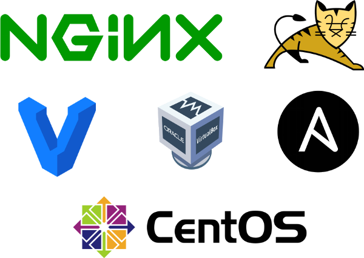
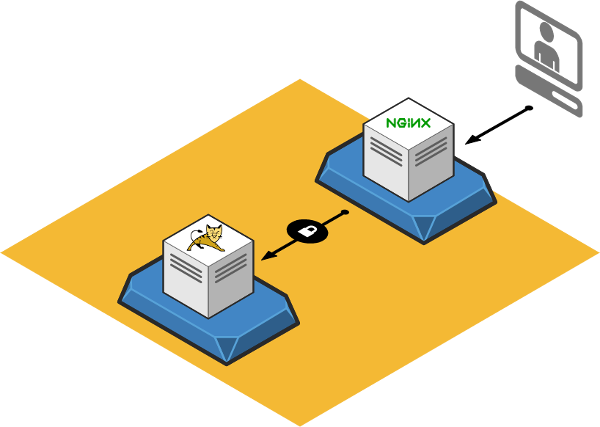

# Why disable SELinux when you can get a NSA level security?
Security Enhanced Linux (SELinux) is a Linux kernel security module that provides a mechanism for supporting access control security policies, including mandatory access controls (MAC).  

It was first developed and then open sourced by the National Security Agency (NSA) in 2000. You can find the current list of contributors [here](https://www.nsa.gov/what-we-do/research/selinux/contributors.shtml)  
 
Back on the early days, SELinux was just so complex that the first thing the great majority of sysadmins did, was to set it to disabled mode. Now a days you should not be doing that, even if you don't have time or availability to study it, you should at least set it to permissive, which basicaly permits everything and generate audit alerts if necessary.  

To check the current status of your SELinux
```bash
$ getenforce 
Enforcing
$
```

To set it to permissive
```bash
$ sudo setenforce 0
```

To make it permanent
```bash
$ sudo sed -i 's/SELINUX=enforcing/SELINUX=permissive/g'  /etc/selinux/config
```

Now, if you have time, is open to learn and to get the benefits of what's considered a best practice in security systems, please keep reading.

# Used tools for this demo
I'm assuming you run GNU/Linux on your desktop, have installed [vagrant](https://www.vagrantup.com/), [ansible](https://www.ansible.com/) and [virtualbox](https://www.virtualbox.org/). The other tools will be downloaded automatically by my automation scripts.  

<p align="center">
  
</p>

# Topology
This is a extremely simple environment with two hosts only.  

<p align="center">
  
</p>

# Bringing up your own environment
After clone my repo, navigate to the project folder and use vagrant to instantiate your own environment.  

```bash
$ git clone https://github.com/fabiogoma/selinux-nginx-tomcat.git
$ cd selinux-nginx-tomcat
$ vagrant up
```
Hopefully, after a few minutes your environment will be up, depending on your internet connection.
