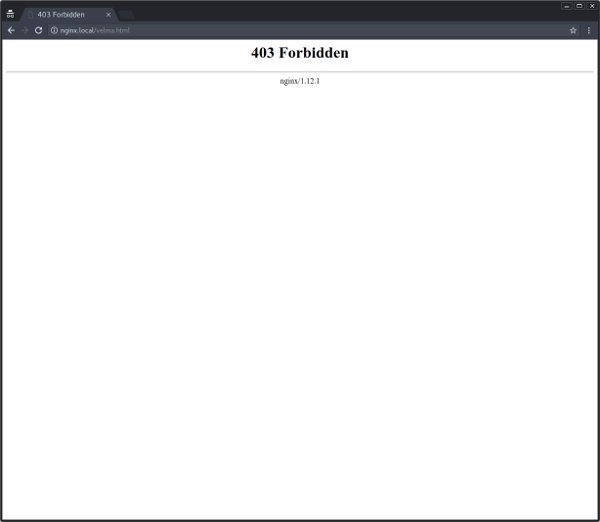
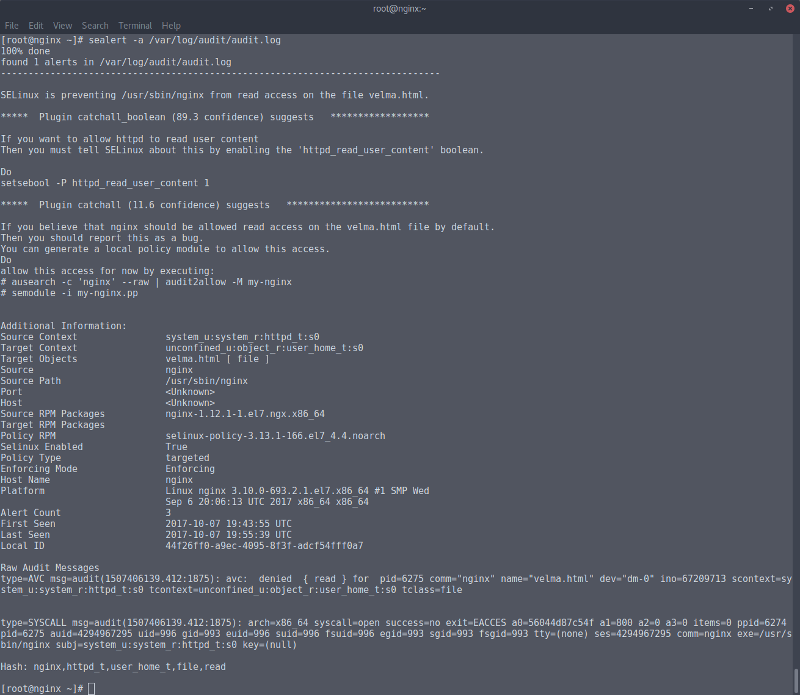
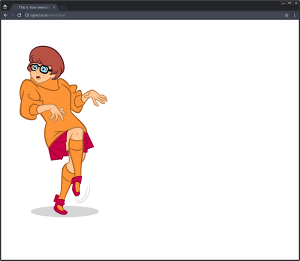
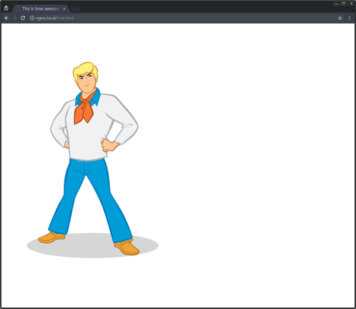
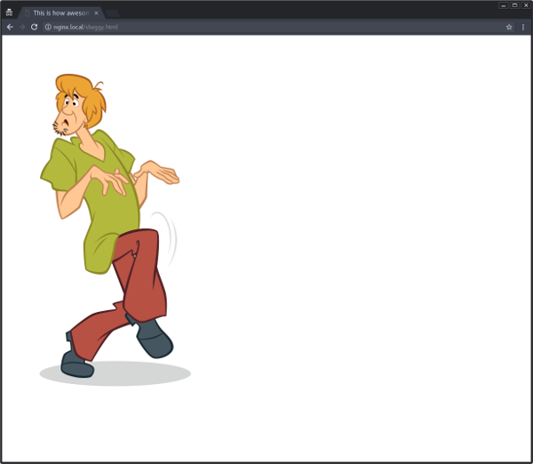
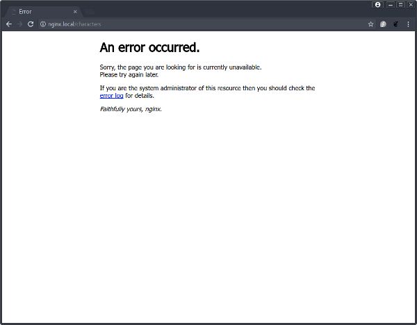
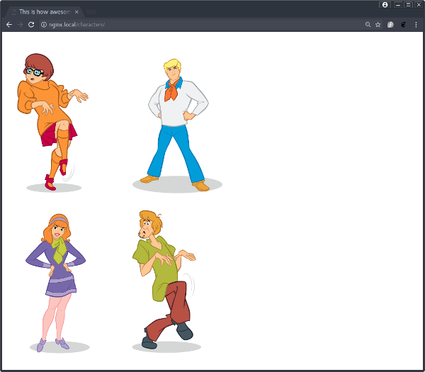

# Why disable SELinux when you can get a NSA level security?
Security Enhanced Linux (SELinux) is a Linux kernel security module that provides a mechanism for supporting access control security policies, including mandatory access controls (MAC).  

It was first developed and then open sourced by the National Security Agency (NSA) in 2000. You can find the current list of contributors [here](https://www.nsa.gov/what-we-do/research/selinux/contributors.shtml)  
 
Back in the early days, SELinux was just so complex that the first thing the great majority of sysadmins used to do, was just disable it. Now a days you should not be doing that, even if you don't have time or availability to study it, you should at least set it to permissive, which basicaly permits everything and generate audit alerts if necessary.  

To check the current status of your SELinux
```bash
$ getenforce 
Enforcing
$
```

To set it to permissive
```bash
$ sudo setenforce 0
```

To make it permanent
```bash
$ sudo sed -i 's/SELINUX=enforcing/SELINUX=permissive/g'  /etc/selinux/config
```

Now, if you have time, is open to learn and to get the benefits of what's considered a best practice in security systems, please keep on reading.

# Tools used on this demo
I'm assuming you run GNU/Linux on your desktop, have installed and configured [nss-mdns](https://github.com/lathiat/nss-mdns), also have installed [vagrant](https://www.vagrantup.com/), [ansible](https://www.ansible.com/) and [virtualbox](https://www.virtualbox.org/). Other tools will be downloaded, installed and configured automatically by ansible playbooks.  

<p align="center">
  
</p>

# Topology
This is a extremely simple environment with two hosts only.  

<p align="center">
  
</p>

# Bringing up your own environment
After clone my repo, navigate to the project folder and use vagrant to provision your own environment.  

```bash
$ git clone https://github.com/fabiogoma/selinux-nginx-tomcat.git
$ cd selinux-nginx-tomcat
$ vagrant up
```
Hopefully, after a few minutes your environment will be up, depending on your internet connection.  
After the execution, both machines will be up and running. One host containing [NGINX](https://www.nginx.com/) and the other [tomcat](http://tomcat.apache.org/). They are both running as a systemd service.  
Both servers have a multicast dns configured, which gives you a capability of reach them by name instead of IP addresses. From your host you can test it, by just making an http request using curl.  

```bash
$ curl tomcat.local:8080
$ curl nginx.local
```
During this demo you will need to ssh the two hosts, I recommend you to use vagrant to do it, otherwise you need to extract the vagrant ssh key generated for each host.

```bash
$ vagrant ssh nginx
```
or
```bash
$ vagrant ssh tomcat
```

This is how the ansible playbooks are organized:
```bash
$ tree provisioning/
provisioning/
├── nginx-playbook.yml
├── roles
│   ├── general
│   │   ├── handlers
│   │   │   ├── main.yml
│   │   │   └── restart-services.yml
│   │   └── tasks
│   │       ├── main.yml
│   │       ├── packages.yml
│   │       └── security.yml
│   ├── nginx
│   │   ├── files
│   │   │   ├── daphne.png
│   │   │   ├── default.conf
│   │   │   ├── fred.png
│   │   │   ├── nginx.repo
│   │   │   ├── shaggy.png
│   │   │   └── velma.png
│   │   ├── handlers
│   │   │   ├── main.yml
│   │   │   └── restart-nginx.yml
│   │   ├── tasks
│   │   │   ├── create-configuration.yml
│   │   │   ├── create-home-pages.yml
│   │   │   ├── create-users.yml
│   │   │   ├── install-nginx.yml
│   │   │   └── main.yml
│   │   └── templates
│   │       └── page.html.j2
│   └── tomcat
│       ├── files
│       │   ├── daphne.png
│       │   ├── fred.png
│       │   ├── index.html
│       │   ├── shaggy.png
│       │   ├── tomcat.service
│       │   └── velma.png
│       ├── handlers
│       │   ├── main.yml
│       │   └── restart-tomcat.yml
│       └── tasks
│           ├── create-npa.yml
│           ├── deploy-static-content.yml
│           ├── install-tomcat.yml
│           ├── main.yml
│           └── manage-service.yml
└── tomcat-playbook.yml

13 directories, 34 files
```
The general role installs a few packages, among others, **setroubleshoot** and **setroubleshoot-server**. This two packages provides a serie of tools that helps on the troubleshooting regarding SELinux issues.

# Time to get your hands dirty
SSH into the NGINX server, switch to root user and move the pages from users to NGINX default html folder
```bash
$ vagrant ssh nginx
[vagrant@nginx ~]$ sudo su -
[root@nginx ~]# mv /home/daphne/* /usr/share/nginx/html/
[root@nginx ~]# mv /home/fred/* /usr/share/nginx/html/
[root@nginx ~]# mv /home/shaggy/* /usr/share/nginx/html/
[root@nginx ~]# mv /home/velma/* /usr/share/nginx/html/
```
Now with files in place, open your browser and try to access one of the pages.
http://nginx.local/velma.html  

If you followed all the steps correctly, you should be able to see a page similar to the page below.  
<p align="center">
  
</p>
:astonished: What? Why? Ok, as an experienced engineer, let's check the permissions.  

```bash
[root@nginx ~]# cd /usr/share/nginx/html/
[root@nginx html]# ls -l
total 276
-rw-r--r--. 1 root   root     537 Jul 11 13:50 50x.html
-rw-r--r--. 1 daphne daphne   155 Oct  7 19:38 daphne.html
-rw-r--r--. 1 daphne daphne 60648 Oct  7 19:38 daphne.png
-rw-r--r--. 1 fred   fred     153 Oct  7 19:38 fred.html
-rw-r--r--. 1 fred   fred   51301 Oct  7 19:38 fred.png
-rw-r--r--. 1 root   root     612 Jul 11 13:50 index.html
-rw-r--r--. 1 shaggy shaggy   155 Oct  7 19:38 shaggy.html
-rw-r--r--. 1 shaggy shaggy 68574 Oct  7 19:38 shaggy.png
-rw-r--r--. 1 velma  velma    154 Oct  7 19:38 velma.html
-rw-r--r--. 1 velma  velma  72203 Oct  7 19:38 velma.png
[root@nginx html]# 
```

:smiley: Ah, that might be the issue. Let's fix it

```bash
[root@nginx html]# chown -R root. *
```

Now let's try again  
<p align="center">
  
</p>
:confounded: What can be possibly wrong? Ok, no reason for panic, here we are going to execute the first command that will use SELinux features to give us a hint.  

```bash
[root@nginx html]# ls -lZ
-rw-r--r--. root root system_u:object_r:httpd_sys_content_t:s0 50x.html
-rw-r--r--. root root unconfined_u:object_r:user_home_t:s0 daphne.html
-rw-r--r--. root root unconfined_u:object_r:user_home_t:s0 daphne.png
-rw-r--r--. root root unconfined_u:object_r:user_home_t:s0 fred.html
-rw-r--r--. root root unconfined_u:object_r:user_home_t:s0 fred.png
-rw-r--r--. root root system_u:object_r:httpd_sys_content_t:s0 index.html
-rw-r--r--. root root unconfined_u:object_r:user_home_t:s0 shaggy.html
-rw-r--r--. root root unconfined_u:object_r:user_home_t:s0 shaggy.png
-rw-r--r--. root root unconfined_u:object_r:user_home_t:s0 velma.html
-rw-r--r--. root root unconfined_u:object_r:user_home_t:s0 velma.png
[root@nginx html]#
```

The parameter **Z** shows us the SELinux context of all files, this paramenter can be used not only with **ls** command, but with a myriad of commands that manipulate files and sockets (i.e: netstat, ps, id etc.). Let's now use our swiss army knives provided by the packages **setroubleshoot** and **setroubleshoot-server** installed during the provision step.

Because our SELinux is by default set to be enforced, every possible risk issue will generate alerts on **/var/log/audit/audit.log**, but this file is too ugly to be seen on a naked eye, let's use the **sealert** tool instead.

```bash
[root@nginx ~]# sealert -a /var/log/audit/audit.log
```
<p align="center">
  
</p>

Here is a good time to talk about SELinux booleans.  

Booleans are on/off switches that allow you to enable or disable access based on the context, you can check all possible booleans available by using the command **getsebool -a** 

Back to our problem, the issue seams to be preety clear on the log reported by sealert, it even gives you a suggestion about how to fix it.

```bash
SELinux is preventing /usr/sbin/nginx from read access on the file velma.html.

*****  Plugin catchall_boolean (89.3 confidence) suggests   ******************

If you want to allow httpd to read user content
Then you must tell SELinux about this by enabling the 'httpd_read_user_content' boolean.

Do
setsebool -P httpd_read_user_content 1

```

What the command **setsebool -P httpd_read_user_content 1** will do is basically set the the boolean to on, this can fix the problem, but also means that nginx process will be able to read all files generated by users, which might not be what we wan't for now.

:orange_book: **With SELinux disabled, there's no boolean controls, which means nginx can read even /etc/shadow if your server has any vulnerability that can be exploited. How good is that, hum?**

Instead of setting this boolean ON, let's change the context of the files, there are two ways to do it, the easy way and the easiest way  

The easy way, make sure you are in the correct folder, check the context of one existent file like index.html for example and use the same datails for your files. We need to change the context of files and for that the command **chcon** will be used:
```bash
[root@nginx html]# cd /usr/share/nginx/html
[root@nginx html]# ls -lZ index.html 
-rw-r--r--. root root system_u:object_r:httpd_sys_content_t:s0 index.html
[root@nginx html]# chcon -u system_u -r object_r -t httpd_sys_content_t velma.*
[root@nginx html]# ls -lZ velma*
-rw-r--r--. root root system_u:object_r:httpd_sys_content_t:s0 velma.html
-rw-r--r--. root root system_u:object_r:httpd_sys_content_t:s0 velma.png
```
Then try to access on your browser http://nginx.local/velma.html
<p align="center">
  
</p>

Now the easiest way, if you know index.html already works, why not just use it as a reference for your files?  
```bash
[root@nginx html]# chcon --reference /usr/share/nginx/html/index.html fred.*
[root@nginx html]# ls -lZ fred.*
-rw-r--r--. root root system_u:object_r:httpd_sys_content_t:s0 fred.html
-rw-r--r--. root root system_u:object_r:httpd_sys_content_t:s0 fred.png
[root@nginx html]# 
```
Then try to access on your browser http://nginx.local/fred.html
<p align="center">
  
</p>

Now, choose one of these two options and do the same for the rest of the files and then try to access them  

This one http://nginx.local/daphne.html  
<p align="center">
  
</p>

And last but not least http://nginx.local/shaggy.html  
<p align="center">
  
</p>

# Communication across the network
Now we are a little bit more familiar with SELinux, I suppose we can assume that it's not that scary right? :dragon:  
Let's now move on to the next step, we are going to access a different endpoint in our NGINX server and that request will be redirected to tomcat on a remote server  

Using your browser, try to access http://nginx.local/characters
<p align="center">
  
</p>

Once again we get and error message instead of what we are expecting. But now we know how to debug, let's use **sealert** again to see if this is an issue related to SELinux

```bash
[root@nginx conf.d]# sealert -a /var/log/audit/audit.log
```

Once again, the logs are very clear about what's happening. SELinux is preventing NGINX daemon to remotely access another server.

```
SELinux is preventing /usr/sbin/nginx from name_connect access on the tcp_socket port 8080.

*****  Plugin catchall_boolean (47.5 confidence) suggests   ******************

If you want to allow httpd to can network connect
Then you must tell SELinux about this by enabling the 'httpd_can_network_connect' boolean.

Do
setsebool -P httpd_can_network_connect 1

*****  Plugin catchall_boolean (47.5 confidence) suggests   ******************

If you want to allow httpd to can network relay
Then you must tell SELinux about this by enabling the 'httpd_can_network_relay' boolean.

Do
setsebool -P httpd_can_network_relay 1

*****  Plugin catchall (6.38 confidence) suggests   **************************
```

:orange_book: **A similar problem would happen if you were trying to access a database for example**

Let's set the booleans suggested by SELinux and see what happens next.

```bash
[root@nginx conf.d]# setsebool -P httpd_can_network_connect 1
[root@nginx conf.d]# setsebool -P httpd_can_network_relay 1
```
Using your browser, check again if you now can access http://nginx.local/characters  
Hopefully you'll see something like that
<p align="center">
  
</p>

# Time to go
I hope by now you no longer think about disable SELinux before you give it a try. The next step is to destroy the environment and free up space on your host. If you are still logged on the VM, exit and return to your host before execute the command below.  

```bash
$ vagrant destroy -f
```

# Credits
[Thomas Cameron](http://people.redhat.com/tcameron/) from [Redhat](http://www.redhat.com) gave a few talks about this same subject and that was the inspiration for this demo.  
His talk is called SELinux for mere mortals and you can find the presentation [here](http://people.redhat.com/tcameron/Summit2016/selinux/selinux_for_mere_mortals.pdf)  

[](https://www.youtube.com/watch?v=cNoVgDqqJmM)

©Hanna-Barbera characters is a registered trademark of the Hanna-Barbera Productions, Inc.